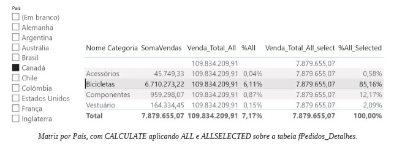

<!-- Âncora do Índice -->
[◀ Voltar](./README.md#indice)

<!-- Âncora do Ínicio do arquivo -->
## <a id="inicio"></a>

# DAX — Exemplos Práticos de Implementação

## 01 — Função CALCULATE com ALL e ALLSELECTED
### Exemplo

<!-- titulo e Imagem referencia -->



*Matriz por País, com CALCULATE aplicando ALL e ALLSELECTED sobre a tabela fPedidos_Detalhes.*


### Fórmulas DAX

```dax
SomaVendas = SUM('fPedidos_Detalhes'[Total])
```

```dax
Venda_Total_All = 
CALCULATE(
    [SomaVendas],
    ALL('fPedidos_Detalhes')
)
```

```dax
Venda_Total_All_Select = 
CALCULATE(
    [SomaVendas],
    ALLSELECTED('fPedidos_Detalhes')
)
```

### Descrição

| Medida | Função | Comportamento |
|---|---|---|
| `SomaVendas` | `SUM` | Soma simples da coluna `Total` da tabela `fPedidos_Detalhes` |
| `Venda_Total_All` | `CALCULATE` + `ALL` | Remove **todos** os filtros da tabela `fPedidos_Detalhes`, retornando o total geral, independente de qualquer filtro ou segmentação aplicada |
| `Venda_Total_All_Select` | `CALCULATE` + `ALLSELECTED` | Remove os filtros internos (ex.: filtros de linha/coluna da visualização), mas **preserva** os filtros externos aplicados via segmentações de dados (slicers) |

<!-- Âncora do Índice -->
[◀ Voltar](./README.md#indice)