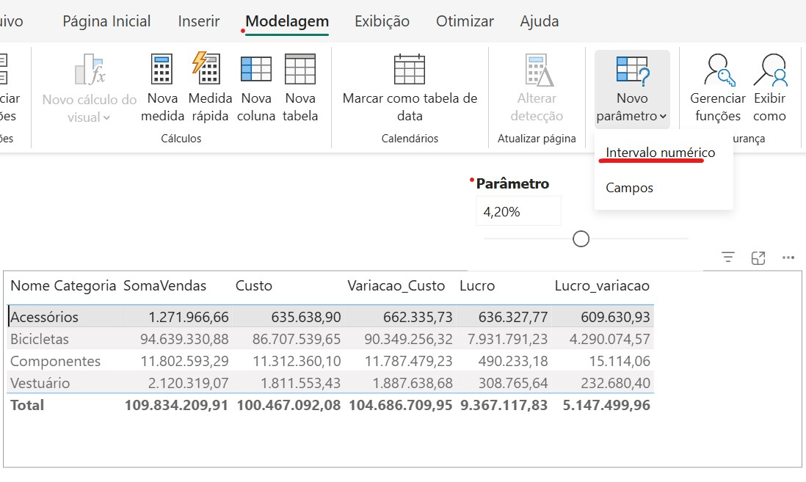

<a id="topo"></a>
<!-- Âncora do Índice -->
[◀ Voltar](./README.md#indice)

<!-- Âncora do Ínicio do arquivo -->
## <a id="inicio"></a>

# DAX — Exemplos Práticos de Implementação
<!-- titulo e Imagem referencia -->



```dax
SomaVendas = sum('fPedidos_Detalhes'[Total])
```
```dax
Parâmetro = GENERATESERIES(0.001, 0.09, 0.001)
Valor Parâmetro = SELECTEDVALUE('Parâmetro'[Parâmetro], 0)
```

```dax
Custo = SUMX('fPedidos_Detalhes',
             'fPedidos_Detalhes'[Quantidade]*
              RELATED(Produtos[Custo Padrão]))
```
```dax
Variacao_Custo = [Custo] + ([Custo]* 'Parâmetro'[Valor Parâmetro])
ou 
Variacao_Custo = --Custo
                 SUMX('fPedidos_Detalhes',
                       'fPedidos_Detalhes'[Quantidade]*
                        RELATED(Produtos[Custo Padrão])) 
                --+ Variação (Custo * Parametro)
                 +(SUMX('fPedidos_Detalhes',
                       'fPedidos_Detalhes'[Quantidade]*
                        RELATED(Produtos[Custo Padrão]))
                   ) * 'Parâmetro'[Valor Parâmetro]

```
```dax
Lucro = [SomaVendas]-[Custo]
```
```dax
Lucro_variacao = [SomaVendas]- [Variacao_Custo]
```


<!-- Âncora do Índice -->
[◀ Voltar](./README.md#indice)
