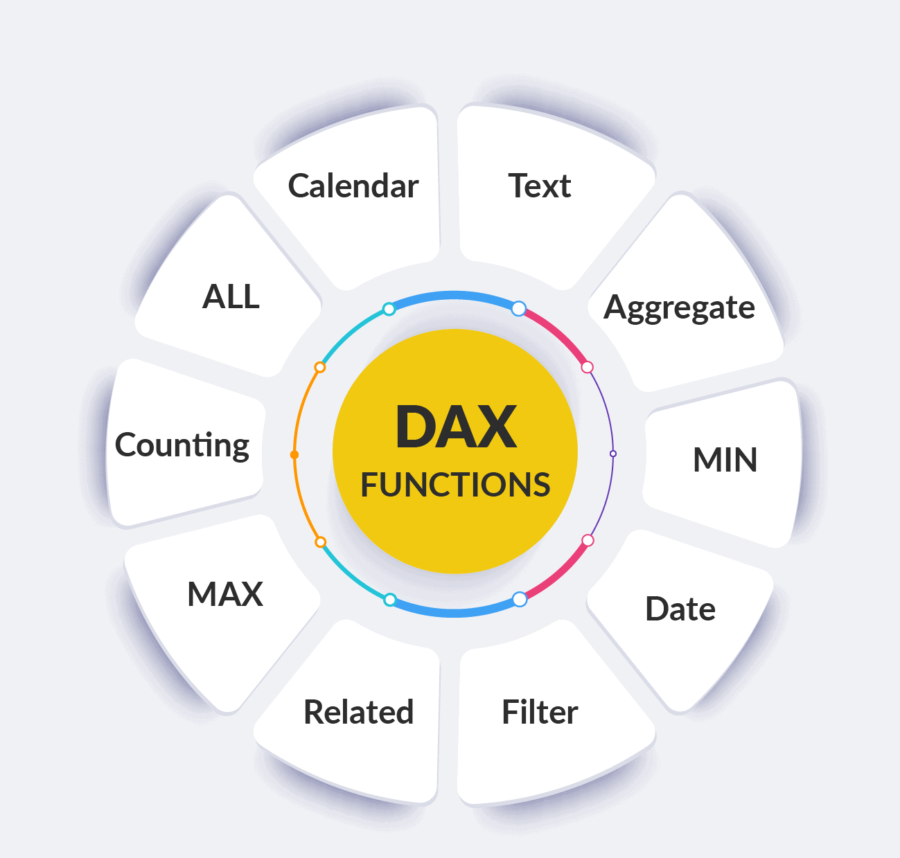

## 

[`▶ Principais Funções:`](https://github.com/FabiodeCMendes/DAX/blob/main/Principais.md)

# DAX — Exemplos Práticos

Documentação com exemplos práticos de implementação em DAX (Data Analysis Expressions), 

<!-- Âncora do Índice -->

## 📌 Índice Interativo

>A  
[ALL](#idxALL)  
[ALLSELECTED](#idxALLSELECTED)  

>B  

>C  
[CALCULATE](#idxCALCULATE)  

>D  

>E  

>F  

>G  

>H  

>I 
[Inteligência de Tempo](#idxTempo) - Funções relacionadas a inteligênciade tempo

>J  

>K  

>L  

>M  
[Medidas Dinamicas com Parametro](#idxSELECTEDVALUE)   

>N  

>O  

>P  
[Parametro de Hipotese](#idxParametros) - Tabela de parametros  
[Parametro para Medidas Dinamicas](#idxSELECTEDVALUE)   

>Q  

>R  

>S  
[SUM](#idxSUM)  
[SUMX](#idxSUMX)  

>T  

>U  

>V  

>W  

>X  

>Y  

>Z  

------------------------------------------------------
<!-- Âncora do Destino -->
## 

### ALL  

**[▶  `CALCULATE` combinada com `ALL` e `ALLSELECTED`.](./01-Calculate-All-AllSelected.md#inicio)**

<!-- Link de retorno -->
[⬆ Voltar](#indice)

------------------------------------------------------
<!-- Âncora do Destino -->
## 

### ALLSELECTED 

**[▶  `CALCULATE` combinada com `ALL` e `ALLSELECTED`.](./01-Calculate-All-AllSelected.md#inicio)**

<!-- Link de retorno -->
[⬆ Voltar](#indice)

-----------------------------------------------------
<!-- Âncora do Destino -->
## 

### CALCULATE 

**[▶  `CALCULATE` combinada com `ALL` e `ALLSELECTED`.](./01-Calculate-All-AllSelected.md#inicio)**

<!-- Link de retorno -->
[⬆ Voltar](#indice)

-----------------------------------------------------
<!-- Âncora do Destino -->
## 

### [Inteligência de Tempo](#idxTempo) - Funções relacionadas a inteligênciade tempo

Fórmulas de Data e Hora & Inteligência de Tempo
    -As funções de inteligência de tempo em DAX no Power BI servem para manipular e comparar dados ao longo de períodos,
     Para usá-las corretamente, você precisa de uma tabela de calendário (calendário de datas) marcada como tabela de data no modelo.
YoY - Year Over Year
MoM - Month Over Month
QoQ - Quarter Over Quarter

     o	DATESYTD -Year To Date   
     o	DATESQTD -Quarter To Date  
     o	DATESMTD -Month To Date  
     o	TOTALYTD -Year To Date  
     o	TOTALQTD -Quarter To Date  
     o	TOTALMTD -Month To Date  

     o	DATEADD  - serve para deslocar um conjunto de datas para frente ou para trás no tempo,
                   permitindo realizar comparações entre períodos (como o faturamento do mês atual versus  
                   o mês anterior ou ano passado)  

     o	DATESINPERIOD - (range de datas) retorna uma tabela com uma única coluna de datas,  
                        usada para calcular totais móveis, médias móveis e acumulados com base em  
                        um período dinâmico

[▶  `e`.](./ParametroHipotese.md#inicio)**

Função	Breve Explicação	Documentação (Microsoft Learn)
DATEDIFF	Retorna o número de intervalos de tempo (dias, meses, anos, etc.) entre duas datas.	DATEDIFF (DAX)

| Função | Breve Explicação | Documentação (Microsoft Learn) |
| :--- | :--- | :--- |
| **DATEDIFF** | Retorna o número de intervalos de tempo (dias, meses, anos, etc.) entre duas datas. | [DATEDIFF (DAX)](https://learn.microsoft.com/pt-br/dax/datediff-function-dax) |
| **YEAR** | Extrai o ano de uma data especificada como um número inteiro de 4 dígitos. | [YEAR (DAX)](https://learn.microsoft.com/pt-br/dax/year-function-dax) |
| **MONTH** | Extrai o mês de uma data como um número de 1 (janeiro) a 12 (dezembro). | [MONTH (DAX)](https://learn.microsoft.com/pt-br/dax/month-function-dax) |
| **DAY** | Extrai o dia do mês de uma data como um número de 1 a 31. | [DAY (DAX)](https://learn.microsoft.com/pt-br/dax/day-function-dax) |
| **HOUR** | Retorna a hora de um valor de data/hora como um número de 0 a 23. | [HOUR (DAX)](https://learn.microsoft.com/pt-br/dax/hour-function-dax) |
| **MINUTE** | Retorna o minuto de um valor de data/hora como um número de 0 a 59. | [MINUTE (DAX)](https://learn.microsoft.com/pt-br/dax/minute-function-dax) |
| **SECOND** | Retorna os segundos de um valor de data/hora como um número de 0 a 59. | [SECOND (DAX)](https://learn.microsoft.com/pt-br/dax/second-function-dax) |
| **TODAY** | Retorna a data atual. | [TODAY (DAX)](https://learn.microsoft.com/pt-br/dax/today-function-dax) |
| **NOW** | Retorna a data e a hora atuais exatas no formato datetime. | [NOW (DAX)](https://learn.microsoft.com/pt-br/dax/now-function-dax) |
| **WEEKDAY** | Retorna um número de 1 a 7 representando o dia da semana de uma data. | [WEEKDAY (DAX)](https://learn.microsoft.com/pt-br/dax/weekday-function-dax) |
| **WEEKNUM** | Retorna o número da semana do ano correspondente a uma determinada data. | [WEEKNUM (DAX)](https://learn.microsoft.com/pt-br/dax/weeknum-function-dax) |
| **DATESYTD** | Retorna uma tabela contendo uma coluna de datas do início do ano até a data atual no contexto (Year To Date). | [DATESYTD (DAX)](https://learn.microsoft.com/pt-br/dax/datesytd-function-dax) |
| **DATESQTD** | Retorna uma tabela com as datas do início do trimestre até a data atual no contexto (Quarter To Date). | [DATESQTD (DAX)](https://learn.microsoft.com/pt-br/dax/datesqtd-function-dax) |
| **DATESMTD** | Retorna uma tabela com as datas do início do mês até a data atual no contexto (Month To Date). | [DATESMTD (DAX)](https://learn.microsoft.com/pt-br/dax/datesmtd-function-dax) |
| **TOTALYTD** | Avalia uma expressão acumulada do início do ano até a data atual (Year To Date). | [TOTALYTD (DAX)](https://learn.microsoft.com/pt-br/dax/totalytd-function-dax) |
| **TOTALQTD** | Avalia uma expressão acumulada do início do trimestre até a data atual (Quarter To Date). | [TOTALQTD (DAX)](https://learn.microsoft.com/pt-br/dax/totalqtd-function-dax) |
| **TOTALMTD** | Avalia uma expressão acumulada do início do mês até a data atual (Month To Date). | [TOTALMTD (DAX)](https://learn.microsoft.com/pt-br/dax/totalmtd-function-dax) |
| **DATEADD** | Retorna uma tabela com datas deslocadas para o futuro ou passado por um intervalo especificado (comparações entre períodos). | [DATEADD (DAX)](https://learn.microsoft.com/pt-br/dax/dateadd-function-dax) |
| **DATESINPERIOD** | Retorna uma tabela de datas dentro de um período dinâmico definido (ideal para totais e médias móveis). | [DATESINPERIOD (DAX)](https://learn.microsoft.com/pt-br/dax/datesinperiod-function-dax) |
| **DATESBETWEEN** | Retorna uma tabela contendo uma coluna de datas entre uma data inicial e uma data final especificadas. | [DATESBETWEEN (DAX)](https://learn.microsoft.com/pt-br/dax/datesbetween-function-dax) |
| **PARALLELPERIOD** | Retorna uma tabela de datas que representa um período paralelo ao contexto atual (ex: mês ou ano completo anterior). | [PARALLELPERIOD (DAX)](https://learn.microsoft.com/pt-br/dax/parallelperiod-function-dax) |

<!-- Link de retorno -->
[⬆ Voltar](#indice)

-----------------------------------------------------

-----------------------------------------------------
<!-- Âncora do Destino -->
## 

[
### Parametro de Hipotese

- Tabela de parametros

[▶  `Parametro de Hipotese`.](./ParametroHipotese.md#inicio)**

<!-- Link de retorno -->
[⬆ Voltar](#indice)

-----------------------------------------------------

-----------------------------------------------------
<!-- Âncora do Destino -->
## 

### SUM

**[▶  `SUM` e `SUMX`.](./02-Sum_SumX.md#inicio)**

<!-- Link de retorno -->
[⬆ Voltar](#indice)

-----------------------------------------------------
<!-- Âncora do Destino -->
## 

### SUM

**[▶  `SUM` e `SUMX`.](./02-Sum_SumX.md#inicio)**

<!-- Link de retorno -->
[⬆ Voltar](#indice)

-----------------------------------------------------
<!-- Âncora do Destino -->
## 

### SELECTEDVALUE e PARAMETRO

**[▶  `SELECTEDVALUE e PARAMETRO`.](./02-SelectedValue.md#inicio)**  
**[▶  `Parametro para Medidas Dinamicas`.](./MedidasDinamicasComParametro.md#inicio)**  
**[▶  `Medidas Dinamicas com Parametro `.](./MedidasDinamicasComParametro.md#inicio)**  

<!-- Link de retorno -->
[⬆ Voltar](#indice)

